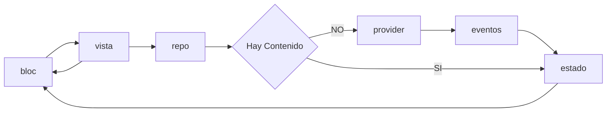

# ShopApp

## Resumen

Este proyecto está desarrollado en Flutter con el lenguaje de programación Dart.

## Requisitos
- Instalar y configurar Flutter en el computador. [Link Flutter](https://flutter.dev/docs/get-started/install)
- Instalar y configurar Android Studio. [Link Android](https://developer.android.com/studio)


> Versión de Flutter 2.10.1


### Generar un Build APK

```sh
# Generar un Build APK
flutter build apk
```

### Generar un Build iOS

```sh
# Generar un Build .plist
flutter run --release
```

> NOTA: En este caso tiene que estar el dispositivo conectado al Mac para poder instalar la aplicación.


# Arquitectura App ShopApp

## BLoC

Para este desarrollo, la `view` utiliza el `repo` para actualizar el estado del `BLoC`, y este a su vez actualiza el contenido de la `view` cuando cambia de estado.





### Creación de proyecto iOS

```sh
# Generar proyecto de iOS
flutter create .
```

NOTA: Al hacer esto se restablecerá todo el proyecto de iOS, se tendrá que configurar nuevamente en Bundle Identifier.


## Getting Started
A few resources to get you started if this is your first Flutter project:

- [Lab: Write your first Flutter app](https://flutter.dev/docs/get-started/codelab)
- [Cookbook: Useful Flutter samples](https://flutter.dev/docs/cookbook)

For help getting started with Flutter, view our
[online documentation](https://flutter.dev/docs), which offers tutorials,
samples, guidance on mobile development, and a full API reference.
